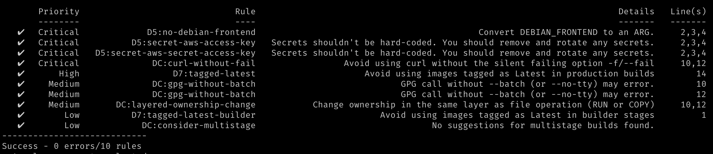

# docked

A Dockerfile linting tool which aims to pull many best practices and recommendations from multiple sources:

* OWASP
* Docker Official Documentation
* Community recommendations
* Package manager bug trackers

[](./LICENSE)

[](https://github.com/jimschubert/docked/actions/workflows/build.yml)
[](https://goreportcard.com/report/github.com/jimschubert/docked)

<!-- [](https://codecov.io/gh/jimschubert/docked) --> 

## tldr;

```
docked analyze ./Dockerfile
```

Outputs:


And, it's customizable (you can ignore, re-prioritize, or add custom regex rules).

## Install

### Binaries

Latest binary releases are available via [GitHub Releases](https://github.com/jimschubert/docked/releases).

### Homebrew

```
brew install jimschubert/tap/docked
```

### Docker

```
docker pull jimschubert/docked:latest
```

When running the docker image, be sure to mount and reference the sources appropriately. For example:

### Completions

After you've installed the binary either manually or via Homebrew, consider enabling completions for your shell. 

For instructions, view help for your target shell.

#### zsh

```
docked completion zsh --help
```

#### bash

```
docked completion bash --help
```

#### fish

```
docked completion fish --help
```

#### powershell

```
docked completion powershell --help
```

## Usage

```shell
$ docked -h

Usage:
  docked [command]

Available Commands:
  analyze     Analyze a Dockerfile for issues
  completion  generate the autocompletion script for the specified shell
  help        Help about any command

Flags:
      --config string   config file (default is $HOME/.docked.yaml)
  -h, --help            help for docked
  -v, --version         version for docked
      --viper           use Viper for configuration (default true)

Use "docked [command] --help" for more information about a command.
```

## Configuration

The optional configuration file follows this example syntax:

```
ignore:
  - D7:tagged-latest
rule_overrides:
  'D5:secret-aws-access-key': low
custom_rules:
  - name: custom-name
    summary: Your custom summary
    details: Your additional rule details
    pattern: '.' # some regex patter
    priority: critical
    command: add
```

## Build

Build a local distribution for evaluation using goreleaser.

```bash
goreleaser release --skip-publish --snapshot --rm-dist
```

This will create an executable application for your os/architecture under `dist`:

```
dist
├── docked_darwin_amd64
│   └── docked
├── docked_linux_386
│   └── docked
├── docked_linux_amd64
│   └── docked
├── docked_linux_arm64
│   └── docked
├── docked_linux_arm_6
│   └── docked
└── docked_windows_amd64
    └── docked.exe
```

Build and execute locally:

* Get dependencies

```shell
go get -d ./...
```

* Build

```shell
go build -o docked ./cmd/docked/
```

* Run

```shell
./docked
```

## License

This project is [licensed](./LICENSE) under Apache 2.0.
